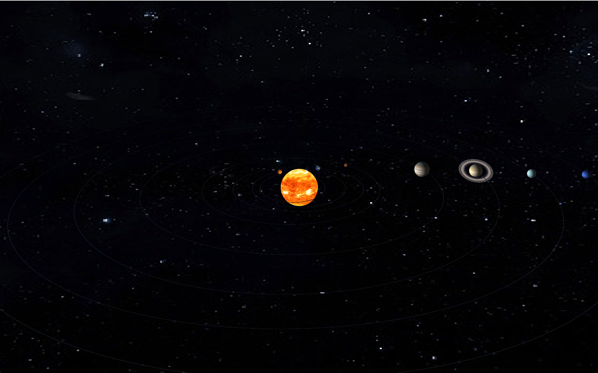

# Interactive 3D Solar System Simulator

A physics-based 3D Solar System simulation built from scratch using **Java** and **JavaFX**. This project combines a custom N-Body physics engine with accurate orbital mechanics (including real inclinations and eccentricities) to create a realistic and interactive space environment.

## What's inside

* **N-Body Physics Engine**: A custom-coded engine that calculates real-time gravitational forces between all objects in the system.
* **Scientific Data**: Planets aren't just moving in circles; they use real NASA data for orbital inclination and eccentricity.
* **Realistic Visuals**:
  * High-resolution textures for planets and an immersive 8K skybox.
  * Procedurally generated **Saturn's rings** visible from both sides.
  * Real-time orbit trails to visualize the actual paths of the planets.
* **Interactive HUD**: Clicking a planet pauses the simulation and brings up a metadata panel with real astronomical stats (Mass, Radius, Temperature, etc.).
* **Collision Physics**: When bodies get too close, they collide and merge based on the conservation of momentum.
* **Total Camera Freedom**: A fully 3D "free-roam" camera system.

## How to use it

| Goal | Input |
| :--- | :--- |
| **Rotate the view** | Left Click + Drag |
| **Move the camera** | Right Click + Drag (or Arrow Keys) |
| **Zoom in/out** | Scroll Wheel (or W / S keys) |
| **Inspect a planet** | Left Click on it (Pauses the sim) |
| **Go back/Resume** | Left Click on empty space |
| **Reset camera** | R key |
| **Play/Pause** | Spacebar |

## Tech Stack

* **Language**: Java 17+
* **Framework**: JavaFX (3D API)
* **Core Concepts**: MVC Architecture, Observer Pattern, and N-Body Gravity Algorithms.

## Getting Started

1. Ensure you have **JDK 17** (or newer) installed.
2. Configure the **JavaFX SDK** in your IDE or project structure.
3. Clone the repository.
4. Run the main class: `SolarSystem3D.java`.

---

## License & Copyright

**Copyright © 2025 [D13GOOOO]. All Rights Reserved.**

This is a **proprietary** project.

* You are not allowed to copy, distribute, or modify this code for commercial use without explicit written permission from the author.
* This code is shared here for demonstration and portfolio purposes.

**Contact**: [diego.guerini.it@gmail.com]