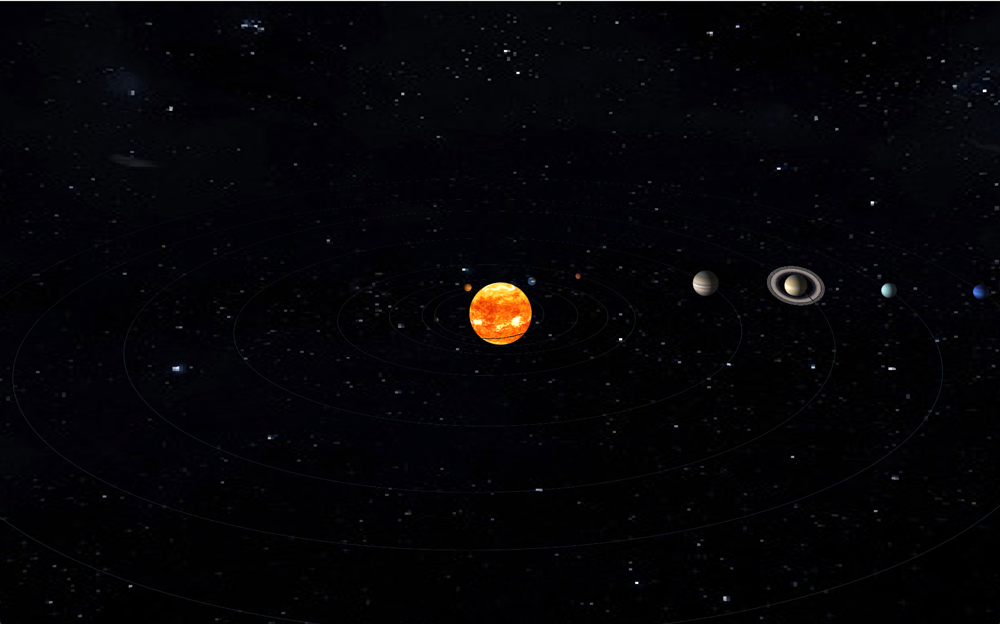

# Interactive 3D Solar System Simulator

An interactive, physics-based 3D simulation of the Solar System built with **Java** and **JavaFX**.
This application features a custom N-Body physics engine, accurate orbital mechanics based on Kepler's laws (including real inclinations), and high-resolution textures.

## 🚀 Features

* **Custom Physics Engine**: Real-time N-Body simulation calculating gravitational forces between all celestial bodies.
* **Scientific Accuracy**: Planets are initialized with real orbital inclinations and eccentricities based on NASA data.
* **Visual Realism**:
    * Textured planets and a starry skybox.
    * Accurate rendering of **Saturn's rings** (visible from all angles).
    * Visual orbit trails representing the elliptical paths.
* **Interactive UI**: Click on any planet to pause the simulation and view real astronomical data (Mass, Radius, Rotation Period, Temperature).
* **Collision System**: Bodies can collide and merge, conserving momentum.
* **Free-Roam Camera**: Full control over the 3D view.

## 🎮 Controls

| Action | Input |
| :--- | :--- |
| **Rotate View** | Left Mouse Button + Drag |
| **Pan Camera** | Right Mouse Button + Drag (or Arrows) |
| **Zoom In/Out** | Scroll Wheel (or W / S keys) |
| **Select Planet** | Left Click on a planet (Pauses simulation) |
| **Resume** | Left Click on empty space |
| **Reset View** | R Key |
| **Pause/Play** | Spacebar |

## 🛠️ Technologies Used

* **Language**: Java 17+
* **GUI Framework**: JavaFX
* **Graphics**: JavaFX 3D (MeshView, PhongMaterial, PointLight)

## 📦 Installation & Run

1.  Ensure you have **JDK 17** or higher installed.
2.  Ensure you have the **JavaFX SDK** configured in your IDE or classpath.
3.  Clone the repository (if you have access).
4.  Run the main class: `SolarSystem3D.java`.

---

## ⚠️ License & Copyright

**Copyright © 2025 [D13GOOOO]. All Rights Reserved.**

This project and its source code are **proprietary**.

* **Unauthorized copying** of this file, via any medium, is strictly prohibited.
* **Distribution**, modification, or commercial use of this code without explicit written permission from the author is not allowed.
* This software is provided for viewing/demonstration purposes only.

For permissions, contact: [diego.guerini.it@gmail.com]